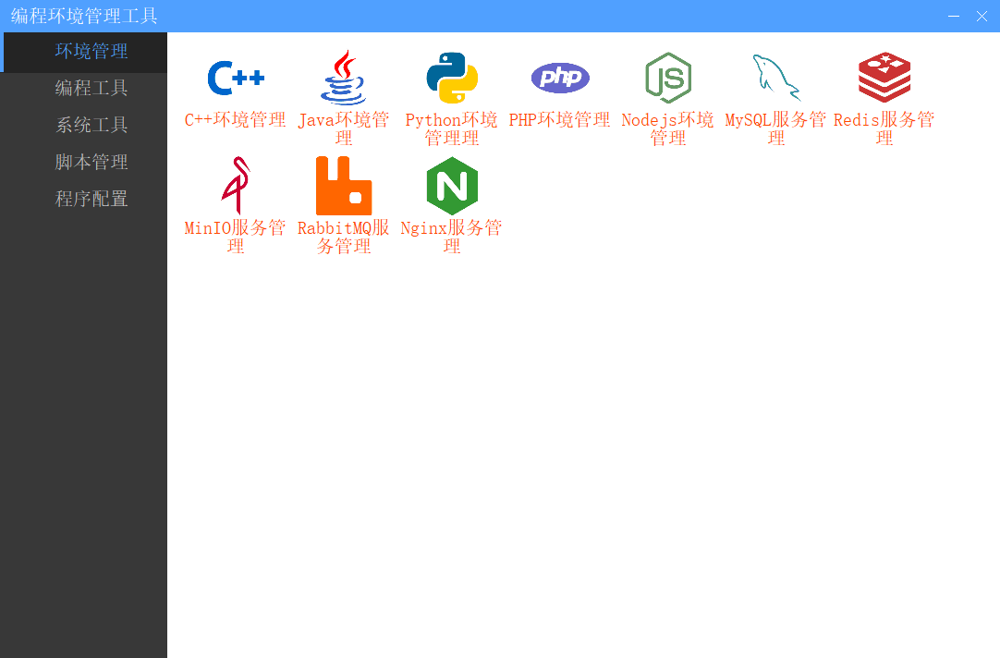

# FastManager.NET

编程盒子

编程盒子第一个版本采用winform编写，下一个版本将使用wpf重构，第二个版本主要对一个版本的功能进行修复，以及技术栈的更新。

1、编程盒子中常用的功能

* 编程环境管理：可以配置Java、Nodejs、Python、C#等等编程环境
* 编程工具管理：可以管理JetBrains程序，JetBrains激活，
* 编程脚本管理：常用的服务的启动和关闭，

这是程序的主页，

## Futures

* 添加国内镜像下载：需要加速的软件，例如Python、Tomcat、Jmeter等国外资源下载，
* 使用插件化开发重构程序
* 重新设计程序架构

## 程序编程环境管理工具

* Nodejs环境管理
* Java环境管理
* MySQL环境管理
* PHP环境管理
* ...

本程序主要针对程序员多语言开发。
一个程序员往往掌握和学习多门编程语言，这个工具有效的隔离编程环境，切换工作空间。

